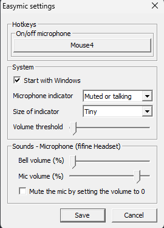

# Easymic

**Easymic** is a lightweight and high-performance desktop application for global microphone control on Windows. Forget about memorizing hotkeys for individual apps like Teams, Discord, TeamSpeak, etc. Easymic centralizes microphone management while ensuring 100% reliability in muting.

By intercepting **system-level microphone callbacks**, Easymic guarantees that your microphone is muted when you need it to be, preventing awkward moments during calls or streams. The app is designed for speed, efficiency, and simplicity, all while consuming minimal system resources.

Built using **Native WinAPI** in **C++**, sacrificing UI beauty for maximum performance.

---

## ⚠️ Attention
VirusTotal may flag Easymic as potentially unwanted due to its global hotkey and system-level audio control features/UAC bypass/UPX compression.
Rest assured, Easymic is open-source and free of malware. 

**You can review the source code yourself. Please don't create issues regarding false positives**

## ✨ Features

### 🎤 Microphone Control
- **Global Hotkey System**  
  Configure multiple customizable hotkeys with support for keyboard + mouse button combinations.
  
- **Available Hotkey Actions:**
  - **Toggle Mute** — Quickly switch your microphone state
  - **Push to Talk** — Hold to unmute, release to mute
  - **Mic Volume Up/Down** — Adjust microphone volume on-the-fly

- **Reliable System Mute**  
  Ensures your microphone is 100% muted by intercepting system-level callbacks — no more guessing!

- **Volume Persistence**  
  Optionally keep your preferred microphone volume level across sessions.

### 📊 Status Indicator
- **Visual State Indicator**  
  A convenient on-screen indicator displays the current microphone state:
  - **Hidden** — No indicator shown
  - **Muted** — Shows muted state only
  - **Muted or Talking** — Shows state with real-time sound detection

- **Customizable Appearance**  
  - Adjustable indicator size
  - Custom mute/unmute icons support
  - Volume threshold configuration for talk detection

- **Window Options**  
  - **Always on Top** — Keep indicator visible above other windows
  - **Exclusive Top Mode** — Enhanced "always on top" using UIAccess (requires elevation)
  - **Exclude from Capture** — Hide indicator from screen recordings and screenshots
  - **Hide When Inactive** — Auto-hide when not in use

### 🔔 Audio Feedback
- **Customizable Sound Notifications**  
  Get audible feedback when microphone state changes with:
  - Built-in Discord-like sounds
  - Custom sound file support (.wav)
  - Adjustable notification volume
  - Recent sound sources remembered for quick access

### 🛡️ Advanced Features
- **UAC Bypass**  
  Skip User Account Control prompts on startup using Windows Task Scheduler.

- **Auto-Updates**  
  - Automatic update checking
  - One-click update installation
  - Skip version option for unwanted updates

### ⚡ Performance
- **Ultra-Fast Response**  
  Instant response to hotkeys at the global level without affecting the input delay of other applications

- **Minimal Memory Footprint**  
  Runs efficiently with only 1-2 MiB RAM in the background.

---

## 🚀 Tech Stack

- **Language:** C++23
- **Framework:** Native WinAPI
- **Build System:** CMake + Ninja
- **Serialization:** [Glaze](https://github.com/stephenberry/glaze) (binary config format)
- **Graphics:** GDI+ for indicator rendering

---

## 📸 Screenshot

<div align="center">
  
</div>


---

## ❓ How to Use

1. **Download** the latest release from the [Releases](https://github.com/k1tbyte/Easymic/releases) page.
2. **Run** `Easymic.exe`.
3. Find it in the **system tray** (bottom right corner).
4. **Double-click** the tray icon or right-click → `Settings` to configure.
5. Set up your preferred **hotkeys** and **indicator** options.
6. Click **Save** to apply settings.
7. Enjoy seamless microphone control!

---

## 📦 Building from Source

### Prerequisites
- CMake 3.27+
- C++23 compatible compiler (MSVC, MinGW, or Clang)
- Ninja build system (recommended)

### Build Steps

1. **Clone the Repository**
   ```bash
   git clone https://github.com/k1tbyte/easymic.git
   cd Easymic
   ```

2. **Build the Project**
   ```bash
   cmake -DCMAKE_BUILD_TYPE=Release -G Ninja -S . -B ./build
   cmake --build ./build
   ```

3. **Run the Application**
   ```bash
   ./build/Easymic.exe
   ```

### Build Options
- `-DENABLE_UPX_COMPRESSION=ON/OFF` — Enable/disable UPX compression for release builds

---

## 📜 License

This project is licensed under the **Apache-2.0 License** — see the [LICENSE](LICENSE.txt) file for details.
